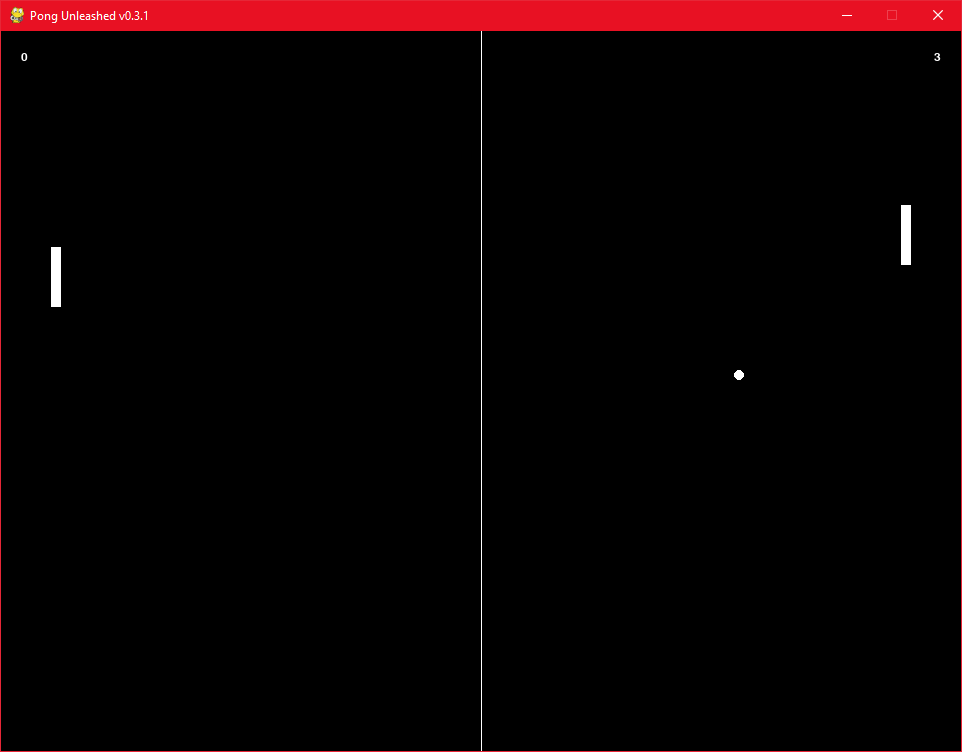

# Pong Unleashed
Latest Version: 0.0.2

Pong Unleashed is a classic pong game implemented in Python using the Pygame library. It offers various game modes, including local multiplayer, single-player against CPU, online multiplayer, and a tutorial mode to help players get familiar with the game mechanics.



## Features

- Classic pong gameplay with simple controls
- Multiple game modes to choose from:
  - Local Multiplayer: Play against a friend on the same computer.
  - VS CPU: Challenge yourself against an AI-controlled opponent with adjustable difficulty levels.
  - Online Multiplayer: Play against a friend over a network by hosting or joining a server.
  - Tutorial: Learn the game mechanics and rules through a step-by-step tutorial.
- Various difficulties in CPU-controlled mode to provide a challenging experience.
- Real-time synchronization of game state in online multiplayer mode.
- Pause functionality for all offline game modes.
- Colorful and responsive graphics using Pygame.

## Installation

To run the game, follow these steps:

1. Make sure you have Python 3.x installed on your system.
2. Clone this repository or download the source code files.
3. Install the required dependencies by running the following commands:
   ```
   pip install pygame
   pip install ipaddress
   ```
4. Run the game by executing the `pong_unleashed.py` file:
   ```
   python pong_unleashed.py
   ```

## Game Controls

### General Controls

- P key: Pause/Unpause the game (Not available in online multiplayer mode).

### Local Multiplayer

- Player 1 (Left Paddle):
  - Move Up: W key
  - Move Down: S key

- Player 2 (Right Paddle):
  - Move Up: Up Arrow key
  - Move Down: Down Arrow key

### VS CPU/Online Multiplayer

- Player 1 (Left Paddle):
  - Move Up: W key
  - Move Down: S key

- CPU (Right Paddle):
  - The CPU paddle is controlled by the AI with adjustable difficulty levels or by another player over the network.

## Networking Setup (Online Multiplayer)

To enable online multiplayer functionality in Pong Unleashed, you can set up a server-hosted game or join an existing game server. The game utilizes sockets for network communication and pickle for data serialization. Follow the steps below to configure the networking setup for online multiplayer:

1. Ensure that you and your opponent are connected to the same network or have access to the internet.

2. Decide who will be the host and who will join the game as the client.

### Host Setup

If you want to host the game, follow these steps:

1. Open the terminal and navigate to the directory where the game code is located.

2. Run the game by executing the Python script: `python pong_unleashed.py`

3. Choose option 3, which represents hosting an online game.

4. Take note of your host IP address, which will be displayed in the terminal. You'll need to provide this IP address to the client for them to connect to your game.

5. Enter a specific port number to host the server on (optional). By default, the port number is set to 12345. Make sure the chosen port is not blocked by your firewall.

Note: If you plan to host a server for online multiplayer over the Internet, you will need to configure port forwarding on your router. Port forwarding allows incoming network connections to reach your server. Consult your router's documentation or refer to online resources for guidance on how to set up port forwarding.

### Client Setup

If you want to join a game as a client, follow these steps:

1. Open the terminal and navigate to the directory where the game code is located.

2. Run the game by executing the Python script: `python pong_unleashed.py`

3. Choose option 4, which represents joining an online game.

4. Enter the IP address of the server you want to connect to.

5. Enter the port number of the server (optional). By default, the port number is set to 12345.

6. If the provided IP address and port are correct, the game will establish a connection to the server, and you will join the game as a client.

### Online Gameplay

Once the host and client are connected, they can start playing Pong Unleashed together. The game will synchronize the game state between the host and the client, allowing both players to see the same paddles and ball positions.

Note: In case of any issues or errors related to networking, ensure that your network allows for socket communication, and the necessary ports are open. Additionally, make sure you have the required dependencies installed, such as Pygame and pickle.

Enjoy playing Pong Unleashed with your friends online!

## Planned Improvements

- Implement power-ups: Add power-ups that appear during gameplay and provide temporary advantages or disadvantages to the players, such as increasing paddle size, adding extra balls, or slowing down the opponent's paddle.
- Sound effects and music: Enhance the gaming experience by adding sound effects for paddle hits, ball collisions, and background music to create a more immersive environment.
- Score tracking and win condition: Implement a scoring system to keep track of each player's score and declare a winner when a certain score threshold is reached.
- Customizable game settings: Allow players to customize game settings, such as ball speed, paddle speed, paddle size, and game duration, to suit their preferences.
- Different ball behaviors: Introduce variations in ball behavior, such as balls that accelerate over time, balls that change direction randomly, or balls that leave a trail behind them.
- Multiple game modes: Add different game modes, such as time trial mode (where players try to score as many points as possible within a limited time), obstacle mode (where obstacles obstruct the ball's path), or target mode (where players aim for specific targets on the screen).
- Visual effects: Enhance the visual appeal of the game by incorporating particle effects, animations, and dynamic backgrounds.
- Difficulty levels: Expand the difficulty levels to provide a gradual progression of challenge, offering options for beginners, intermediate players, and advanced players.
- Multiplayer online matchmaking: Implement an online matchmaking system that allows players to compete against opponents of similar skill levels.
- High scores and leaderboards: Add a high score system and leaderboards to encourage competition among players and provide a sense of achievement.
- Customizable paddle skins: Allow players to choose different paddle skins or even upload their own custom images to personalize their paddles.
- Achievements and rewards: Introduce achievements or unlockable rewards for completing specific challenges or reaching milestones within the game.
- Support for UPnP for server hosting and matchmaking.
- Implement server-based multiplayer support and matchmaking.
- Implement splash screen and GUI
- Scoring systems
- Direct connect functionality
- Settings file
- Usernames and randomized identifier strings
- Improved security for multiplayer
- Something RJ wants
- Something the first person to ask for a feature wants(as long as it's relevant and reasonable, submit via issues.)
- Ease of use features (Less quitting constantly, more returning to menu.)
- Fix the litany of bugs currently in v0.0.2
- QOL adjustments, such as having the ball go one or the other way depending on 1) random chance, 2) the last player to win serves, or 3) other variables i.e. constantly to one or the other side, as well as other things like paddles and window resizability without breaking things

## License

Pong Unleashed is licensed under the [GPLv3 License](LICENSE).

## Acknowledgements

- This game was developed using the Pygame library: [https://www.pygame.org/](https://www.pygame.org/)
- Original game credit goes to Atari, Inc. and Allan Alcorn, designer of Pong.
- Inspiration credit goes to my good friend RJ, who inspired me to create this as my first game.

## Contributing

Contributions to Pong Unleashed are welcome! If you find any bugs or have suggestions for improvements, please open an issue or submit a pull request on the GitHub repository.

## About

Pong Unleashed was developed by Ashtin Wilkin-Blanchard. You can find more of my projects on [GitHub](https://github.com/SlammingProgamming).

Enjoy playing Pong Unleashed! Have fun!